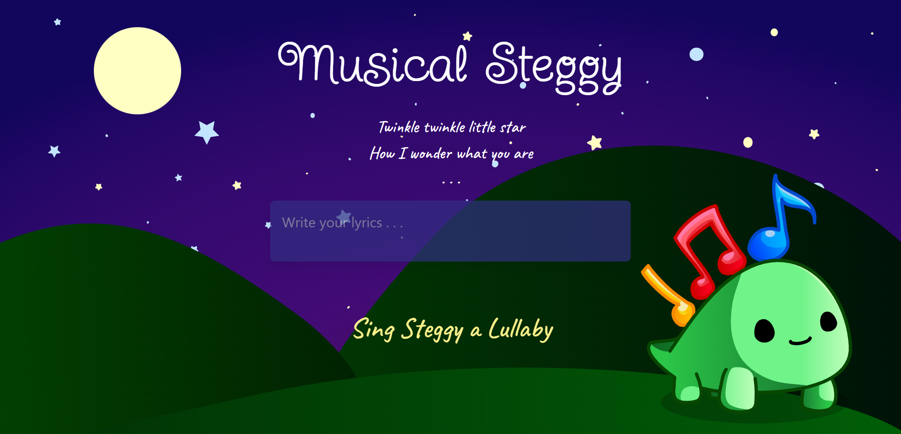

# MusicalSteggy

## About
Musical Steggy is a web app that performs music steganography, hiding text in music. The entered text is transformed into musical notes that accompany the lullaby "Twinkle Twinkle Little Star". [Here](https://www.soundslice.com/slices/vmRkc/) is an example of what "hello" could sound like.

### Built With
- [Next.js](https://nextjs.org/)
- [Tailwind CSS](https://tailwindcss.com/)
- [MusicXML](https://www.musicxml.com/)

## Prerequisites

- Make sure you have npm
  `npm install npm@latest -g`

## Installation

- Use `npm i` to install all dependencies
- Host at [http://localhost:3000/](http://localhost:3000/) using `npm run dev`
